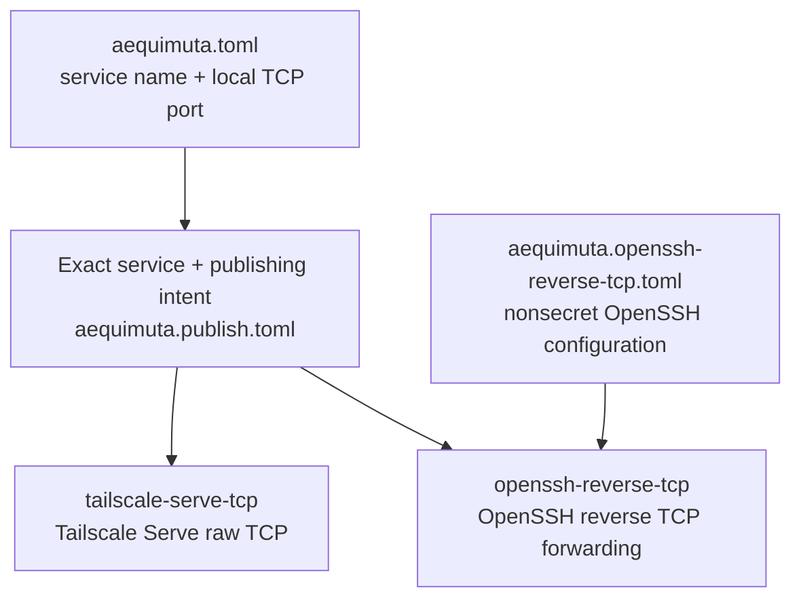

# Aequimuta

> **Declare the service once. Change the publisher, not the service.**

Aequimuta is a CLI that publishes local TCP services through interchangeable
mechanisms such as Tailscale Serve and OpenSSH reverse forwarding—without
changing the service declaration.

In Aequimuta, a publisher is a concrete mechanism that exposes a local service,
such as Tailscale Serve or OpenSSH reverse forwarding. A publisher is selected
by its exact capability token; Aequimuta does not currently have a plugin system
or generic Publisher API.

Aequimuta keeps the service definition neutral without pretending that
different publishing mechanisms have identical lifecycle or status semantics.

## 30-second proof

Declare a local service once:

```toml
# aequimuta.toml

[[services]]
name = "web"
port = 8080
```

Declare two independent publishing intents:

```toml
# aequimuta.publish.toml

[[publications]]
service = "web"
publisher = "tailscale-serve-tcp"

[[publications]]
service = "web"
publisher = "openssh-reverse-tcp"
```

Select either concrete mechanism:

```sh
aequimuta publish web tailscale-serve-tcp
aequimuta publish web openssh-reverse-tcp
```

The service definition stays the same. Only the publishing mechanism changes.
OpenSSH also needs its own nonsecret connection and listener configuration;
that configuration remains separate from both files above.

## The problem

A typical publishing script or provider-specific workflow mixes several
concerns:

- service identity and local port
- provider command and external listener
- credentials and trust
- lifecycle and conflict behavior

Changing the publishing mechanism then means rewriting both the service
definition and its operational workflow. Aequimuta focuses on removing that
unnecessary coupling. It does not claim to solve every networking, routing, or
credential problem.

## The Aequimuta model

Aequimuta separates three responsibilities:

1. **Service declaration** — `aequimuta.toml` says what local TCP service is
   being published.
2. **Publishing intent** — `aequimuta.publish.toml` selects an exact
   `(service, publisher)` relation.
3. **Concrete operation and configuration** — each mechanism keeps its actual
   lifecycle, conflict rules, and any configuration it genuinely needs.



The diagram shows the current concrete paths. It does not imply a plugin
registry, reconciliation engine, ownership database, or runtime daemon.

## Supported capabilities

Aequimuta currently supports exactly two operational publisher tokens:

- `tailscale-serve-tcp` — tailnet-private Tailscale Serve raw TCP forwarding
- `openssh-reverse-tcp` — fixed OpenSSH remote TCP forwarding backed by a
  dedicated background SSH ControlMaster session

The current commands are:

```text
aequimuta version
aequimuta init
aequimuta validate
aequimuta validate-publishing
aequimuta publish <service> <publisher>
aequimuta status <service> <publisher>
```

`status` currently supports only `tailscale-serve-tcp`. OpenSSH publication has
no authoritative read-only status command in Aequimuta.

## Quick start

### Build

Build the current repository with Cargo:

```sh
cargo build --release
```

The examples below assume `target/release/aequimuta` is available on `PATH` as
`aequimuta`. No package-manager or prebuilt-binary installation path is
currently documented here.

### Initialize

Create a project in the current directory:

```sh
aequimuta init
```

`init` creates only `aequimuta.toml`, initially containing a comment. It does
not create publishing or provider-specific configuration files, and it does not
overwrite an existing filesystem entry with the same name.

### Define a service

Edit `aequimuta.toml`:

```toml
[[services]]
name = "web"
port = 8080
```

The service is an exact name and a local TCP port. The local backend used by
both current mechanisms is `127.0.0.1:8080`.

### Define publishing intent

Create `aequimuta.publish.toml`:

```toml
[[publications]]
service = "web"
publisher = "tailscale-serve-tcp"

[[publications]]
service = "web"
publisher = "openssh-reverse-tcp"
```

### Validate

Validate the core service declaration:

```sh
aequimuta validate
```

Validate the service declaration first, then the relationship between it and
the publishing intent:

```sh
aequimuta validate-publishing
```

`validate-publishing` checks publisher token syntax, service references, and
exact tuple duplicates. It does not validate whether a token is operationally
supported, provider-specific conflicts, or the OpenSSH configuration file. The
selected OpenSSH publish path validates that file when it runs.

### Publish with Tailscale

With a running local backend and a suitable local Tailscale environment:

```sh
aequimuta publish web tailscale-serve-tcp
aequimuta status web tailscale-serve-tcp
```

The publish path creates the exact mapping when the selected slot is absent, or
reports an exact existing mapping as already satisfied. The status result
describes the provider mapping relation, not local application health or
endpoint reachability.

### Publish with OpenSSH

Create `aequimuta.openssh-reverse-tcp.toml` and replace every example value with
values appropriate for your SSH environment:

```toml
[[publications]]
service = "web"
host = "edge.example.com"
user = "aequimuta"
ssh_port = 22
listen_address = "0.0.0.0"
listen_port = 18080
```

Then publish:

```sh
aequimuta publish web openssh-reverse-tcp
```

OpenSSH credentials and strict host-key trust must already be available in the
machine-local OpenSSH environment. Aequimuta does not accept credentials in the
project files.

## Publisher comparison

| Property | `tailscale-serve-tcp` | `openssh-reverse-tcp` |
| --- | --- | --- |
| Mechanism | Tailscale Serve raw TCP forwarding | OpenSSH remote TCP forwarding |
| Visibility | Tailnet-private | Depends on the configured remote bind, SSH server policy, routing, firewall, and NAT |
| Local backend | `127.0.0.1:<service.port>` | `127.0.0.1:<service.port>` |
| Lifetime | Tailscale-managed Serve configuration | Background SSH ControlMaster session |
| Behavior after CLI exits | Serve configuration is retained by Tailscale | Forward remains only while the dedicated SSH master remains alive |
| Automatic reconnect | Not provided by Aequimuta; lifecycle is Tailscale-managed | No |
| Reboot persistence | Tailscale-managed Serve configuration; no separate Aequimuta guarantee | No |
| Publish outcome | Created or Already satisfied | Ensured |
| Status support | `absent`, `satisfied`, `conflict`, `indeterminate` | Unsupported |
| Credential and trust source | Machine-local Tailscale environment | Machine-local OpenSSH configuration, keys or agent, and host trust |
| Provider-specific configuration | None | `aequimuta.openssh-reverse-tcp.toml` |

A requested remote bind address does not guarantee public reachability. Remote
SSH policy, routing, firewall, and NAT still apply.

## Safety model

Aequimuta prefers refusing an operation over silently overwriting provider
state it cannot safely interpret.

The current safety boundaries include:

- exact, case-sensitive `(service, publisher)` selection
- strict TOML schemas and unknown-field rejection
- operational rejection of unsupported publisher tokens
- rejection of ambiguous desired provider slots
- no overwrite of incompatible existing provider state
- fail-closed treatment of provider state that cannot be interpreted safely
- Tailscale post-condition verification after creation
- OpenSSH server acknowledgement before an `Ensured` result
- no broad provider reset or automatic takeover
- no assumption that an unknown state is absent
- no modification of project TOML files by `publish` or `status`
- no secret fields in the Git-trackable OpenSSH provider configuration

These boundaries are not an absolute transaction or concurrency guarantee.
Tailscale publication assumes a single writer across the preflight-to-mutation
window. OpenSSH publication is session-backed and does not create a durable
ownership record or authoritative remote snapshot.

## Current limitations

- TCP services only
- local backend fixed to `127.0.0.1:<service.port>`
- no project-wide apply or reconciliation
- no unpublish or delete command
- no durable ownership database
- OpenSSH status unsupported
- OpenSSH automatic reconnect unsupported
- OpenSSH reboot persistence unsupported
- no generic Publisher plugin API
- no third publisher
- no HTTP, HTTPS, or UDP publishing capability

Aequimuta intentionally avoids introducing a generic Publisher abstraction
before concrete implementations prove which behavior is genuinely shared.

## Documentation

- [Design](docs/design.md)
- [Tailscale Serve TCP provider guide](docs/providers/tailscale-serve-tcp.md)
- [OpenSSH reverse TCP provider guide](docs/providers/openssh-reverse-tcp.md)
- [Demo walkthrough](docs/demo.md)

## Development and validation

The repository is validated with Rust formatting, Clippy, integration tests,
and a build:

```sh
cargo fmt --all -- --check
cargo clippy --all-targets -- -D warnings
cargo test --all-targets
cargo build
```

The integration suite includes deterministic subprocess-boundary tests for
both mechanisms and an isolated real OpenSSH `sshd` end-to-end data-path test.
External Tailscale and SSH environments still determine real deployment
visibility and lifecycle.
